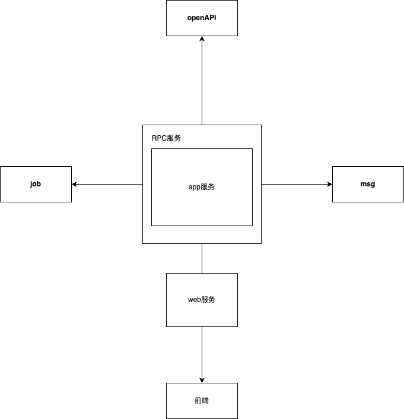

# BOOT-ADMIN

>
> BOOT-ADMIN是一个基于[Spring Boot3](https://spring.io/projects/spring-boot)和[Vue3](https://v3.cn.vuejs.org/)
> 的开源项目，项目采用前后端分离的模式,前端框架使用[vue-pure-admin](https://github.com/pure-admin/vue-pure-admin)
>
> 项目使用应用模块化开发，每个模块独立部署，模块之间通过RPC调用。
>
> 项目源码地址：[https://github.com/hb0730/boot-admin](https://github.com/hb0730/boot-admin)
>
> 项目演示地址：[http://boot-admin.hb0730.com](http://boot-admin.hb0730.com)
>
> 用户名：admin
> 密码：Admin123456
>

## 技术栈

### 后端

- [Spring Boot](https://spring.io/projects/spring-boot)
- [Spring Security](https://spring.io/projects/spring-security)
- [Spring JPA](https://spring.io/projects/spring-data-jpa)
- [Spring Data Redis](https://spring.io/projects/spring-data-redis)
- [Sofa RPC](https://www.sofastack.tech/projects/sofa-rpc/overview/)
- [SpringDoc OpenAPI](https://springdoc.org/)
- [Quartz](http://www.quartz-scheduler.org/)

### 前端

- [Vue3](https://v3.cn.vuejs.org/)
- [Vite](https://cn.vitejs.dev/)
- [Element Plus](https://element-plus.gitee.io/#/zh-CN)
- [TypeScript](https://www.typescriptlang.org/)
- [Pinia](https://pinia.esm.dev/)
- [Tailwind CSS](https://www.tailwindcss.cn/)
- [Pure Admin](https://github.com/pure-admin)

## 项目结构

```text
├── boot-admin-app -- 主应用
├── boot-admin-web -- 前端应用
├── boot-admin-job -- 定时任务
├── boot-admin-msg -- 消息服务
├── boot-admin-open -- 开放服务
├── boot-admin-api -- 接口模块( API服务接口定义)
├── boot-admin-base -- 基础模块
├── boot-admin-conf -- 配置模块
```

## 示意图



## 项目启动

- 基础环境启动
  包含mysql8,redis等服务
  ```
  docker compose -f docker-compose.infra.yml up -d
  ```

## 端口说明

| 端口    | 说明               |
|-------|------------------|
| 9001  | App应用端口          |
| 9002  | Web应用端口          |
| 9003  | Msg应用端口          |
| 9004  | Job应用端口          |
| 9005  | Open应用端口         |
| 12200 | Sofa RPC Bolt端口  |
| 8341  | Sofa RPC Rest端口  |
| 12300 | Sofa RPC H2c端口   |
| 20880 | Sofa RPC Dubbo端口 |

## 如何快速启动

>
> 请先安装 [docker](https://docs.docker.com/get-docker/)
>

* step1: 启动基础环境
  ```shell
  # 启动基础环境
   cd docker && docker compose -f docker-compose.infra.yml up -d
  ```

* step2: 导入SQL
  > SQL文件在 docs/sql 目录下

* step3: 启动服务
  > 保证9001，9002，12200等端口未被占用

* step4: 访问
  > 访问 http://localhost:9002/api/v6/swagger-ui.html

## Docker 文件说明

* `app.Dockerfile` 为app应用Dockerfile, 用于构建app应用镜像
* `web.Dockerfile` 为web应用Dockerfile, 用于构建web应用镜像
* `docker-compose.yml` 为docker-compose配置文件, 用于启动app,web,job,msg,open等服务
* `docker-compose.infra.yml` 为docker-compose配置文件,
  用于启动mysql8,redis等基础服务, `docker compose -f docker-compose.infra.yml up -d`
  启动,`docker compose -f docker-compose.infra.yml down` 停止