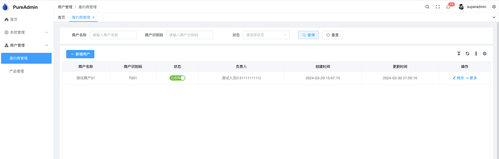
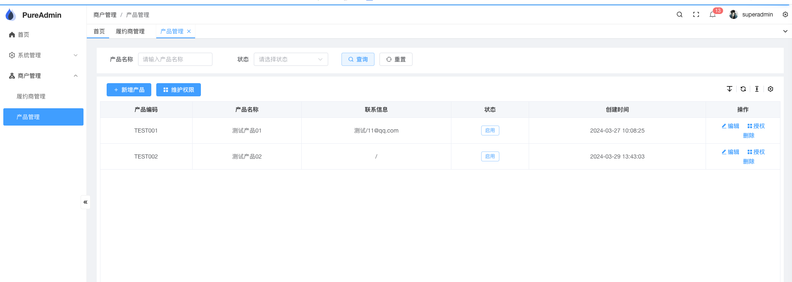
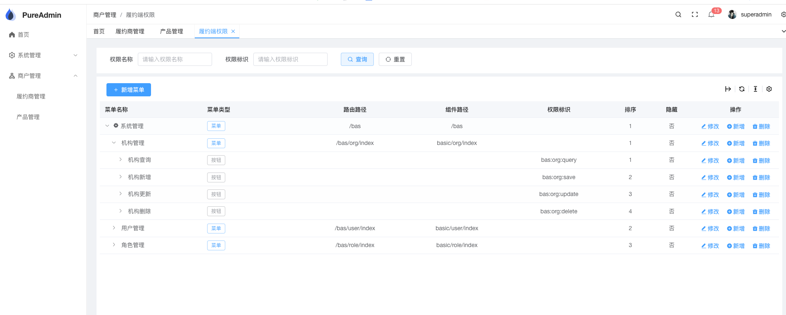
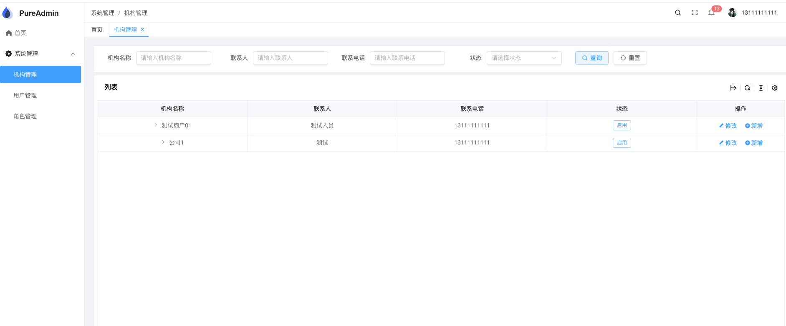
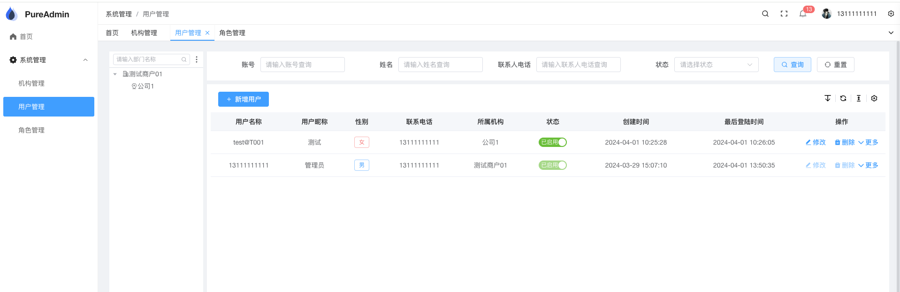

# BOOT ADMIN

> [boot-admin](https://github.com/hb0730/boot-admin)是一个基于[Spring Boot3](https://spring.io/projects/spring-boot)
> 和[Vue3](https://v3.cn.vuejs.org/)的`SAAS`管理后台开源项目，项目采用前后端分离的模式, 的开源项目，项目采用前后端分离的模式,
> 前端框架使用[vue-pure-admin](https://github.com/pure-admin/vue-pure-admin)

|                                  |                                  |                                  |
|----------------------------------|----------------------------------|----------------------------------|
|  |  |  |
|  |  |  |

## 开源地址

|        | 前端                                                    | 后端                                                 |                                          
|--------|-------------------------------------------------------|----------------------------------------------------|
| Github | [boot-admin](https://github.com/hb0730/boot-admin-ui) | [boot-admin](https://github.com/hb0730/boot-admin) |
| Gitee  | [boot-admin](https://gitee.com/hb0730/boot-admin-ui)  | [boot-admin](https://gitee.com/hb0730/boot-admin)  |

## 项目结构

```shell
├── app  # core 核心应用
├── api  # api RPC 接口 
├── commons # 公共模块 相关组件
├── web # web 管理后台
```

## 项目特点

- 前后端分离
- 前端采用[vue-pure-admin](https://github.com/pure-admin/vue-pure-admin)
- 后端采用[Spring Boot3](https://spring.io/projects/spring-boot)
- 采用 [Spring JPA](https://spring.io/projects/spring-data-jpa) 作为数据持久层
- 采用 [Spring Security](https://spring.io/projects/spring-security) 作为安全框架
- 采用 [Sofa RPC](https://github.com/alipay/sofa-rpc) 作为RPC框架

## 端口说明

| 端口    | 说明               |
|-------|------------------|
| 9001  | App应用端口          |
| 9002  | Web应用端口          |
| 9003  | Msg应用端口          |
| 9004  | Job应用端口          |
| 9005  | 	Open应用端口        |
| 12200 | 	Sofa RPC Bolt端口 |
| 8341  | Sofa RPC Rest端口  |
| 12300 | Sofa RPC H2c端口   |
| 20880 | Sofa RPC Dubbo端口 |

## 预览地址

**在线服务部署海外环境**

### 管理端/超级管理员端

> https://boot-admin.hb0730.com/#/admin
> 用户名: superadmin
> 密码: Admin123456

### 租户端/履约端

> https://boot-admin.hb0730.com
> 用户名: 13111111111
> 密码: Admin123456